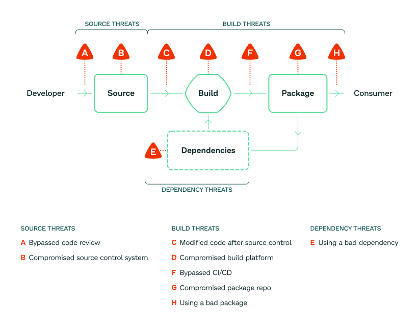

# Improving artifact integrity across the supply chain

<!---->

**NOTE: This site is best viewed at https://slsa.dev.**

<!---->

SLSA ("[salsa](https://www.google.com/search?q=how+to+pronounce+salsa)") is **Supply-chain Levels for Software Artifacts.**

A security framework from source to service, giving anyone working with software a common language for increasing levels of software security and supply chain integrity.

<section class="buttons-horizontal">

[SLSA levels](levels.md)

[Requirements](requirements.md)

</section>

<!-- Levels overview -->
<section class="content-block">

## Four steps to advanced protection

**It can take years to achieve the ideal security state - intermediate milestones are important.** SLSA guides you through gradually improving the security of your software. Artifacts used in critical infrastructure or vital business operations may want to attain a higher level of security, whereas software that poses a low risk can stop when they're comfortable.

That’s where SLSA can help, building intermediary levels to assess where software’s come from, and how its being used in a software supply chain.

| Level | Description                                   |
| :---- | :-------------------------------------------- |
| **1** | Documentation of the build process            |
| **2** | Tamper resistance of the build service        |
| **3** | Prevents extra resistance to specific threats |
| **4** | Highest levels of confidence and trust        |

</section>

<section class="breakout">

## Building towards an industry consensus

We’re developing SLSA collectively to tackle common threats across the supply chain.

[Get involved](getinvolved.md)

</section>

<!-- Supply chain diagram -->
<section class="content-block">

<section class="col-2">

## How do you mitigate risks and threats to your supply chain?

Recent high profile supply chain attacks prove how costly an attack can be. It’s difficult to check the integrity of software artifacts today, but SLSA wants to fix that with a set of integrity requirements developers can follow to improve the security of the software they produce.

See SLSA compared to [known supply chain attacks](levels.md#threats).

## Standard security guidelines that scale for your future

Software consumers can choose software that provides the needed level of security. SLSA levels are a way to better understand your current security posture, and plan for the future. You can check that the security information for any software in your supply chain is accurate manually, and help develop and share tools that automate the process.

[Read the requirements](requirements.md)

</section>

<!-- Github actions breakout -->
<section class="breakout">

## See a GitHub Actions demo

Check our demonstration for SLSA level 1 with [a provenance generator for GitHub Actions](https://github.com/slsa-framework/github-actions-demo).

</section>

<!-- Two column wrap-up -->
<section class="col-2 content-block">

## SLSA is currently in alpha

The framework is constantly being improved. We encourage the community to try adopting SLSA levels incrementally and to share your experiences back to us.

Google has been using an internal version of SLSA since 2013 and requires it for all of Google's production workloads.

[See our roadmap](roadmap.md)

## Get involved

SLSA is building towards an industry consensus. We’re developing SLSA collectively to tackle common threats across the supply chain.

We rely on feedback from other organisations to make it more useful for more people. We’d love to hear from you about your experiences using SLSA.

**Are the levels achievable in your project? Would you add or remove anything from the framework? What’s preventing you from adopting it today?**

[Join the conversation](getinvolved.md)

